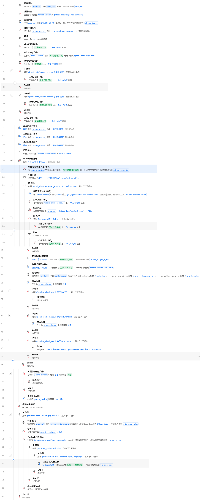

# 当前影刀实际流程

## 2026-10-07 14:17 三次无新内容退出已配置，初始化修正后待复测（当前）

- 最新状态：用户已完成连续无新内容计数、普通IF及复用退出动作。13:54实际截图确认88—99行的结构正确。14:10从头运行到52行报`free variable 'section_finished' referenced before assignment in enclosing scope`，本次未进入结果循环；14:17用户确认已按下表修正51行初始化，正在完整复测，尚无新运行结果。不能写成三次退出已实测成功。
- 46行仍为列表filter_text_points，保留原筛选OCR文字中心坐标计算表达式；不要因本次初始化错误改掉46行，也不要重做已通过的43—49筛选动作。51行是独立的section_finished初始化。
- 当前行号依据120行：在119行检查点新增90行计数卡；普通IF及End IF替换旧图像IF及其End IF，净增0行。13:54截图验证如下结构，其他保留行从旧90起顺延1；这不是全流程重新截图审计。

| 行号 | 指令／配置 |
|---|---|
| 50 | 设置变量：列表result_scan_state；Python单行`[[], 0]`，每个栏目进入While前初始化 |
| 51 | 设置变量：布尔section_finished；Python单行`False`，已启用；在52行While外、与While同级；14:17用户确认已修改 |
| 52 | While：Python单行`(not section_finished) and author_check_result != "MATCH"` 等于Python `True` |
| 86—88 | 结果页截图dy_result_screen.png → 离线OCR完整结果result_ocr_result → 信息日志；沿用已验证链 |
| 89 | 列表result_content_signature；结果区OCR文字去空白、排序，排除顶部时钟与导航 |
| 90 | 列表result_scan_state；保存本屏快照、同屏计数加1、新内容计数清零 |
| 91 | 普通IF：Python `result_scan_state[1] >= 3` 等于Python `True` |
| 92—93 | 在91判断内：布尔section_finished=True → 退出当前52行结果While |
| 94 | 结束91行判断 |
| 95—96 | 原向上滑动（在IF外、While内） → 结束52行While |
| 97—99 | 原MATCH判断及退出15行栏目循环，保留 |
| 110—120 | 原互动块仍全部禁用 |

89行完整Python表达式（单行）：
`[sorted("".join(item["text"].split()) for item in result_ocr_result if item["box"][1] > nav_swipe_points["left"]["start_y"] and item["text"].strip())]`

90行完整Python表达式（单行）：
`[result_content_signature, result_scan_state[1] + 1 if result_content_signature == result_scan_state[0] else 0]`

- 第一屏建立基线计数0；每次结果滑动后，文字快照相同才加1，新内容出现清零。外层列表区分首次无基线[]与空屏快照[[]]。按每次运行OCR文字比较，不是固定坐标，也不是整个栏目总共仅查三屏。旧“暂无更多”图像判断及配对End IF已删除；无需结束词出现。
- 类型栏目（图文／视频）连续三次滑动无新内容后进入综合；综合同样连续三次后结束搜索，沿用原结果分支：遇过ID不同仍无MATCH提示抖音号不同；否则未找到目标作品。MATCH仍立即退出，原候选遍历和作者ID核验均保留。
- 当前待办只等复测结果：52行能否进入；图文／视频三次无新内容能否切综合；综合同样三次后是否正常结束。若继续报错，按实际行号和错误处理，不猜配置。95滑动后应给内容加载时间，当前高级等待参数尚未在这轮截图中核对，不能称已设置5秒。
- 筛选OCR动态点击仅当前单手机图文已通过；本轮退出、其他栏目、跨手机及完整作者核验未验证。OCR快照比较的是结果文字，新图像但相同文字并不保证被判为新内容，不夸大覆盖。

以下各节为历史检查点；其中旧行号、已完成待办及未实施结论均以上述最新记录为准。
## 2026-10-07 12:03 三次无新内容计数配置进度（当前）

- 用户已确认复制设置变量到50行初始化：列表result_scan_state，Python单行[[], 0]，每个栏目在While之前初始化一次。原section_finished=False顺延51、While顺延52。
- 用户12:03确认已添加89行内容快照：列表result_content_signature，Python单行 `[sorted("".join(item["text"].split()) for item in result_ocr_result if item["box"][1] > nav_swipe_points["left"]["start_y"] and item["text"].strip())]`。依据现有导航动态start_y排除顶部/时钟，比较结果区OCR文字；去空白并排序，忽略score与输出顺序。外层列表确保空内容快照[[]]与首次初始化[]不同，第一轮建立基线不算一次滑动无变化。module1.make_nav_swipe_points实际字典键left/start_y已读库核实，不是猜测。
- 当前已确认总119行：50初始化state、51finished=False、52While；86结果截图、87OCR、88日志、89快照、90旧图像IF、91finished=True、92退出While、93EndIF、94结果滑动、95循环结束。原互动109—119禁用。
- 当前下一步复制设置变量到89之后成为90：变量类型列表，变量名仍result_scan_state，Python单行 `[result_content_signature, result_scan_state[1] + 1 if result_content_signature == result_scan_state[0] else 0]`，错误处理默认。同屏加一，新内容清零，并保存本屏供下次比较。此更新卡尚未由用户确认，current_rows保留119行。
- 添加更新卡后总120，旧图像IF为91、finished设置92、退出93、EndIF94、结果滑动95、循环结束96。之后将旧图像结束判断改成普通条件IF，连续无新内容计数>=3即可复用finished=True及退出当前结果循环；这项尚未实施。还应保持足够的滑动后加载等待再计数，实际参数待核对。
- 用户明确规则继续有效：图文/视频结果无新内容连刷三次后转综合；综合同样三次无新内容后结束查找。有新内容清零，各栏目独立计数；不是总屏数仅三屏，不要求结束词出现，不把无提示状态强制改成异常。
- 筛选三条动态OCR点击及结果页OCR日志已有运行证据；初始化/快照/新计数尚未整体运行验证，循环退出仍未修复。其他栏目、跨手机、完整作者核验未通过。不要提前运行未完成的退出逻辑验证而称已解决。

以下历史内容的行号与待办以本节为准。

## 2026-10-07 11:52 用户确定：连续三次无新内容后结束当前栏目（当前）

- 11:49用户日志截图确认第87结果页OCR日志已添加并运行：多次第53昵称日志与第87结果页OCR完整结果交替出现，文字输出含上午11:48等。此前result_ocr_result未定义的截图是历史；本次结果页截图→OCR→日志链已出结果。完整OCR正文仍未复制提供。
- 当前用户明确反馈图文手机画面已在最底部，底部没有结束标识，多次运行没有新内容，程序持续循环。以此补充此前“暂无更多，查看所有内容”画面，不能只修一个结束词。
- 用户明确新规则：到无新内容状态后再刷三次仍无新内容，结束图文并转综合；综合同样到底后三次仍无新内容则结束搜索，给出未找到。以该授权覆盖此前“无提示无进展只报异常、不结束栏目”的方案。三次按连续无新内容滑动计数，不是整个栏目只查前三屏；出现新内容清零，每个栏目重新初始化。
- 当前实际总117行：85结果页截图、86离线OCR、87信息日志、88原图像到底IF、89 section_finished=True、90退出51循环、91 EndIF、92结果向上滑动、93结果循环结束。原互动107—117禁用。到底判断和无进展计数均尚未改。
- 当前下一步复用第46设置变量，复制到当前50 section_finished=False之前：新50列表变量result_scan_state，Python单行[[], 0]，错误处理默认；表示上一屏内容快照与连续无进展计数。此卡尚未由用户确认，current_rows仍117。添加后原50变51、While变52、结果截图86、OCR87、日志88、原图像IF89、finished设置90、退出91、滑动93、循环结束94，总118。
- 之后在结果截图/OCR位置比较当前结果内容与上一屏，连续三次无变化时复用原section_finished=True和退出结果循环动作；综合沿用相同判定。内容比较应忽略手机时钟、OCRscore、读取顺序等变化，不能单凭目标是否找到或整份OCR字典相等判断，也不能只比较作者昵称造成同作者多作品误判。具体表达式与结束IF仍待实施及运行验证。
- 筛选三条动态OCR点击已通过；结果遍历退出、完整作者核验、其他栏目和跨手机仍未通过。保持图文/视频优先再综合及原候选ID核验流程，不重做已验证筛选，不用固定坐标。
- 用户表格内容是否实际超过24小时仍未核验，不能据此修改表格或取消一天内筛选。

以下更早检查点为历史；三次无新内容结束栏目的规则以上述最新用户授权为准。

## 2026-10-07 10:54 GitHub进度同步（最新继续位置）

- 筛选阶段已通过用户实际运行测试：入口点击前等待5—6秒；最新发布、一天内、查看结果均复用原点击卡，按本次OCR识别出的完整文字动态计算坐标。
- 已确认添加85结果页截图、86结果页离线OCR，输出result_ocr_result。最新明确确认的流程为116行；1—105启用、106—116原互动块禁用。
- 已提供第87打印日志的完整配置：信息级别、Python单行 `"结果页OCR完整结果=" + repr(result_ocr_result)`。用户尚未明确确认这条日志是否添加，也未提供其实际输出，因此不将117行写成已确认现状。如果日志已添加，原图像IF为88、设置section_finished为89、退出为90、滑动为92，总117行。
- 当前未解决：结果页到底时仍重复扫描/滑动。实际底部已出现“暂无更多，查看所有内容”，旧图像判断未命中；用户还反馈其他提示及无结束词的情况。
- 下一步从结果页OCR日志继续：确认日志卡已添加，获取到达底部时最后一条完整输出；依据真实OCR文字替换原到底图像判断，保留原section_finished与退出循环动作。无结束词但持续无进展的停止处理尚未实施，加载失败不能直接判成未找到目标。
- 不重做筛选、不用固定坐标、不重捕各手机模板、不设置搜索总循环次数上限。Python表达式必须单行。
- 尚未通过：结果列表退出、完整作者核验流程、其他栏目/跨手机。不要把筛选成功写成整流程成功。

以下记录包含已确认参数；新会话直接从本节继续。

## 2026-10-07 10:44 结果页OCR已添加，待读取到底提示（当前）

- 用户10:38提供实际手机画面：图文结果已经到底，底部可见“暂无更多，查看所有内容”，之前原第85图像到底IF未命中并反复滑动。用户另反馈还存在其他结束文字和没有结束词的情况；其他提示具体原文/实际OCR尚未提供，不编造已验证的结束词全集。
- 用户10:41确认复制手机截图至原85之前，10:44确认复制影刀离线OCR至截图之后。当前已实施总116行：85结果页截图、86结果页OCR、87原图像到底IF、88 section_finished=True、89退出51循环、90 EndIF、91原向上滑动、92结果循环结束。此前1—84不变，原114行从85起顺延2；互动106—116仍禁用。
- 第85截图复用第43：phone_device；保存文件夹Python __import__("tempfile").gettempdir()；普通文本自定义文件名dy_result_screen.png；无输出变量；错误处理默认。
- 第86离线OCR复用第44：图片路径Python __import__("os").path.join(__import__("tempfile").gettempdir(), "dy_result_screen.png")；输出完整结果开启；文字检测框过滤阈值0.5；检测框大小2；输出result_ocr_result；错误处理默认。已有配置尚未取得本次结果页OCR日志，不写成新结果页链已测试通过。
- 下一步复制第45日志，放86 OCR之后成为87；信息级别、Python单行 "结果页OCR完整结果=" + repr(result_ocr_result)，错误处理默认。此日志尚未由用户确认，current_rows保持116；加入后原图像IF顺延88，finished设置89、退出90、滑动92、结果循环结束93，总117。
- 日志加入后连续运行，到手机再次显示之前的底部画面时停止，把最后一条结果页OCR完整结果用于判定实际文字及分框。之后用OCR判断明确结束提示，保留原finished设置和退出循环动作；新IF尚未实施。没有结束词但内容持续无变化的处理也尚未实施。
- 正常到底应结束当前栏目并继续原综合兜底；加载失败/持续无进展不能默认算已查完或未找到。不得取消一天内筛选、设总循环次数上限、重新捕获各手机图像。
- 筛选动态OCR点击三项已通过；结果列表退出和作者核验整流程仍未通过，跨手机未验证。

以下更早检查点为历史，当前下一步以上述内容为准。

## 2026-10-07 10:31 OCR筛选通过，排查结果列表循环退出（当前）

- 用户已完成三条动态OCR坐标点击配置，并明确反馈筛选动作成功通过测试。第47最新发布、第48一天内、第49查看结果现均复用原点击卡，完整文字精确查找filter_text_points中的本次x/y；不再通过原图像模板执行这三个筛选点击。测试范围为本次手机运行，不写成跨设备/所有栏目已通过。
- 当前总114行，41等待5到6秒、42点击筛选入口、43手机截图、44OCR、45日志、46列表变量、47—49动态点击；后续51结果逐屏While，52读取昵称，53日志，85原图像到底IF，86 section_finished=True，87退出51循环，89结果向上滑动，90循环结束。原互动104—114仍禁用。
- 用户反馈表格作品可能超过24小时，筛选一天内后无法找到目标；程序后段某行及85/89持续重复，怀疑死循环。作品实际过期尚未独立核验；缺少循环时手机画面、到底提示及85实际匹配参数，不能断言模板不匹配就是已证实根因。
- 目标不在一天内结果，本应仍遍历结果，真正到底退出当前栏目，再查综合；两个栏目均结束后根据既有ID不符标记输出“抖音号不同”或“未找到目标作品”。不因日期推測修改表格、不取消一天内、不添加固定循环次数上限、不删除原循环结构。
- 第85若一直未匹配到底图像，第86/87就不执行，继续第89滑动并返回51/52；如果画面已到底且不再移动，这会造成重复扫描。当前下一步：停止本次运行，获取当前手机完整画面，特别是底部结束/空结果提示；据真实状态确定85如何退出。已跑通的截图/OCR可复用到后续到底判断，但尚未新增或修改这一逻辑。
- 当前仅筛选子流程通过；作者核验与栏目结束整流程未通过，循环退出排查仍待证据。

以下更早检查点为历史，当前进度以上述内容为准。

## 2026-10-07 10:22 动态OCR点击配置（当前）

- 10:15截图确认既有5到6秒等待已从入口点击之后移至之前：41等待、42点击抖音筛选入口、43手机截图、44影刀离线OCR、45日志、46filter_text_points、47最新发布、48一天内、49查看结果；当前总114行，后续结构不变。本次连续运行成功打开筛选并通过原47图像匹配点击最新发布，在48原图像点击报“找不到对应图像”。该次调整有效，尚未证明所有设备或任意加载时间均可靠。
- 手机截图、OCR及单行列表变量已实施；用户明确认可每次OCR识别坐标，拒绝固定坐标。filter_text_points每次按当前截图的完整目标文字和box计算x/y，不输入示例截图中的数字、不按桌面DPI换算、不每手机重捕模板。
- 10:17实际“点击屏幕(手机)”配置窗口字段已核实：手机连接对象、点击位置“通过坐标指定”、横坐标、纵坐标、点击方式“单击”；横/纵输入切换Python表达式。高级和错误处理保留原设置。
- 第47最新发布动态点击已由用户10:21明确确认设置；第48一天内已提供完整配置，用户随后“继续”，未单独展示设置截图；第49查看结果当前提供下一步完整配置，尚未确认。不得把已配置写成已运行通过。
- 三条原点击卡复用，不新建点击卡，不插入新行。后续从手机主界面连续运行，观察最新发布、一天内的选中状态及查看结果关闭弹窗；坐标映射/点击效果和作者核验整流程仍未验证，其他栏目/跨手机未验证。

第47最新发布：
- 横坐标Python单行：`[item["x"] for item in filter_text_points if item["text"] == "最新发布"][0]`
- 纵坐标Python单行：`[item["y"] for item in filter_text_points if item["text"] == "最新发布"][0]`

第48一天内：
- 横坐标Python单行：`[item["x"] for item in filter_text_points if item["text"] == "一天内"][0]`
- 纵坐标Python单行：`[item["y"] for item in filter_text_points if item["text"] == "一天内"][0]`

第49查看结果：
- 横坐标Python单行：`[item["x"] for item in filter_text_points if item["text"] == "查看结果"][0]`
- 纵坐标Python单行：`[item["y"] for item in filter_text_points if item["text"] == "查看结果"][0]`

以上均phone_device、通过坐标指定、单击；高级/错误处理保留原设置。每个表达式只能单行输入。

以下更早检查点为历史，当前下一步以上述内容为准。

## 2026-10-07 10:12 连续运行筛选入口排查（当前）

- 用户已添加filter_text_points列表变量；Python表达式必须单行输入，禁止再提供多行值。本次截图确认41点击抖音筛选入口、42等待5到6秒、43手机截图、44影刀离线OCR、45打印日志、46设置filter_text_points、47原通过图像匹配点击最新发布。因此之前不确定的等待已确认存在，新增变量也已实施，当前累计114行；未实施OCR文字点击。
- 用户从手机主界面直接运行，本次日志明确10:09:51.466开始，10:10:17.802第45行打印OCR完整结果，10:10:19.205第47行“找不到对应图像”；手机搜索并从综合切至图文后不再变化，用户未观察到筛选打开。截图中OCR日志被截断，不能编造完整文字或断言弹窗从未瞬时打开。
- 已有证据：暂停在41后点“下一步”能打开筛选并获得正确三目标OCR；连续运行未观察到打开。优先验证筛选点击前的页面状态或时机差异，但尚未证实根因。
- 当前下一步只有一项：复用第42等待5—6秒，移动到第41点击筛选入口之前，保持等待参数及点击配置不变，不新建等待、不重新捕获元素。移动后41等待、42点击筛选入口、43截图及后续行号不变。此移动尚未由用户确认，current_rows暂保留截图实际顺序。
- 从手机主界面再次连续运行，观察筛选是否弹出；第47仍为旧图片点击，其报错不能单独证明入口是否打开。如果仍未打开，再用43手机截图断点确认执行42之后的实际画面；不重复改变识别阈值。
- 主流程仍未通过；OCR实测范围仍为单手机图文弹窗逐步执行；其他栏目/跨手机、连续运行打开筛选、动态坐标点击均未验证。

已实施第46变量值（Python单行）：

```python
[{"text": item["text"].strip(), "x": (item["box"][0] + item["box"][2]) // 2, "y": (item["box"][1] + item["box"][3]) // 2} for item in filter_ocr_result if item["text"].strip() in ("最新发布", "一天内", "查看结果")]
```

以下更早检查点为历史，当前下一步以上述内容为准。

## 2026-10-07 09:57 筛选弹窗OCR验证成功（当前下一步）

- 用户实际调试按钮名称为“下一步”。在第41断点暂停时该条尚未执行；点击“下一步”执行原筛选入口点击后，手机确实弹出未选择的筛选界面。第41原配置在本次暂停后逐步执行中生效，不改元素选择器、不重新捕获。此前连续运行未得到筛选画面，原因仍未证实；页面状态或时机差异只是推测，不能写成已解决。
- 用户继续执行截图、OCR、日志，最新完整结果确为筛选弹窗：最新发布 score=0.99427426、box=[339,477,487,521]；一天内 score=0.9901774、box=[353,780,472,830]；查看结果 score=0.9961338、box=[710,1315,877,1359]。三个目标在该次结果各出现一次，可按完整文字精确查找并由本次box计算点击中心。score为OCR置信度，不能当作图像相似度。
- 本次仅验证一台手机、图文栏目、一次筛选弹窗截图的文字和位置输出。尚未实施文字定位点击，尚未验证连续运行成功、其他栏目或跨手机；主流程未完整通过。OCR同时识别了弹窗下方搜索结果文字，不采用包含/模糊匹配。
- 下一步只添加一条“设置变量”，位置在打印OCR日志之后、原点击“最新发布”之前。变量类型“列表”；变量值切换Python表达式，见下；变量名filter_text_points；错误处理默认。此卡尚未由用户确认插入，因此不变更current_rows或已确认112行。
- 后续复用原最新发布、一天内、查看结果点击卡，根据上述列表内完整文字取本次运行的x/y执行点击，不另建点击卡、不输入本次截图的固定坐标。切换点击位置后的真实UI字段需据实际界面确认；首个点击效果与坐标映射仍待验证。
- 额外固定等待5秒是否曾插入仍无明确确认，当前112行映射保留；新增设置变量用动作前后位置定位，不猜当前行号。

待添加变量值（Python）：

```python
[
    {
        "text": item["text"].strip(),
        "x": (item["box"][0] + item["box"][2]) // 2,
        "y": (item["box"][1] + item["box"][3]) // 2
    }
    for item in filter_ocr_result
    if item["text"].strip() in ("最新发布", "一天内", "查看结果")
]
```

以下09:48及更早内容为历史，当前下一步以上述检查点为准。

## 2026-10-07 09:48 筛选入口点击排查（最新下一步）

- 用户说明：固定等待与上一步是否生效无关，运行时第41筛选入口似乎未完成打开就进入后续。停止继续增加等待，优先验证实际点击效果。此前“添加等待5秒”的待办不再作为当前下一步；用户未明确确认该等待卡是否已经插入，因此不据此变更已确认112行映射。
- 三张配置截图：第41点击元素(手机)，phone_device，操作目标“抖音筛选入口”；高级为单击、执行后延迟1秒、锚点中心点、等待元素存在5秒。元素编辑器保留mobile/hierarchy/android.view.ViewGroup链；当前底节点只勾accessibility-id等于“筛选，按钮”，id/index-attribute/index均未勾；校验找到1个元素。截图未展示根层属性或实际元素bounds，不编造这些数据。
- 这些截图没有直接证明参数错误，也不能证明运行时点击生效。不随意改双击、偏移、元素条件或重新捕获，不把“等待元素存在5秒”当作等待筛选弹窗打开。
- 当前下一步：关闭配置窗口，在第41行行号后的空白处设置橙色断点，从编辑器顶部运行完整流程；暂停在41时该条尚未执行，phone_device/task_data已由前面步骤获取。观察手机结果页加载完成后，只点一次“单步调试”，执行41并暂停在下一条，直接观察筛选弹窗是否出现。不从中间孤立执行导致phone_device缺失，不继续执行截图/OCR来掩盖点击效果。
- 如果单步成功打开，优先检查连续运行时的页面状态/时机；如果单步仍未打开，下一步核对目标实际范围和点击效果。以上为诊断分支，尚无测试结论。
- 官方调试依据：https://www.yingdao.com/community/detaildiscuss?id=3e9e8e8f-e4a8-4c4f-b3cd-e6db2fe9c53a 。已有OCR输出证明能读搜索结果文字及box，所需筛选弹窗和OCR点击仍未验证，跨手机未验证。

下面09:39的首次OCR运行证据保留；其中追加等待的待办以上述最新排查方向为准。

## 2026-10-07 09:39 OCR首次运行检查点（当前）

- 第42手机截图、第43影刀离线OCR、第44信息打印日志已添加并运行；日志Python `"筛选OCR完整结果=" + repr(filter_ocr_result)`。按插入链推算当前112行，1—101启用，102—112原互动块禁用。原109行FINAL-3保留为基线，下面旧表格不能直接作为当前行号。
- 实测09:35:41开始，09:36:04第44行输出OCR完整结果，09:36:07在第45行原“最新发布”图像点击报“找不到对应图像”。日志结果确为列表，每项含text/score/box；路径输入、截图及OCR到日志链已运行。未完整跑通主流程，未测试跨设备。
- OCR读到上午9:36、云南旅居、图文、全部/民宿/租房等以及结果卡片正文，含“加载中，请稍后住到了人生最满意的”；未读到最新发布、一天内、查看结果。当前截图内容为搜索结果页，不是所需筛选弹窗。多数清晰字识别分数高，但存在部分误字与合并文本，不写成完全准确。
- 不能仅凭结果断言第41筛选点击未生效或截图过早。下一步验证截图时机：在41筛选入口点击与42手机截图之间插入固定等待5秒，尚未添加；添加后新42等待、43截图、44OCR、45日志、46原最新发布、47一天内、48查看结果，总113行。等待后仍无筛选文字，再核查41的点击实际效果；不要继续调OCR阈值或图像相似度。
- 当前已实施截图配置：phone_device；保存文件夹Python `__import__("tempfile").gettempdir()`；普通文本文件名dy_filter_screen.png；无输出变量；错误处理默认。
- 当前已实施OCR配置：图片路径Python `__import__("os").path.join(__import__("tempfile").gettempdir(), "dy_filter_screen.png")`；输出完整结果开启；文字检测框过滤阈值0.5；文字检测框大小2；输出filter_ocr_result；错误处理默认。使用市场指令“影刀离线OCR”分组下同名指令。
- 当前41筛选入口，42截图，43OCR，44日志，45最新发布图片点击，46一天内，47查看结果，48 section_finished=False，49 While，50读取昵称，51原昵称日志。旧42及之后行累计顺延3行。
- 匹配必须基于完整文字；综合/视频/图文卡片大小、内容、排列有明显差别，筛选弹窗无法由元素分别定位。禁止固定坐标匹配、按卡片外观匹配或每手机重捕模板。OCR位置用于本次文字定位后执行点击；当前尚未实现OCR文字筛选与点击。
- 原最新发布图片55%仅为此前单模板单手机暂定值。保留原图片点击动作供后续复用，尚未改成OCR点击；不批量设置所有模板55%，不承诺OCR跨设备已通过。

以下检查点和109行表格为历史；当前状态与待办以上述内容为准。

## 2026-10-07 筛选识别测试检查点

- 当前仍为2026-10-06-FINAL-3的109行配置；本次只记录测试，不新增指令、不修改模块、不改行号。1—98启用，99—109原互动块禁用。
- 10月6日首次整流程手机运行在第42行“最新发布”图像点击停止，日志为“找不到对应图像”；筛选弹窗已打开。未完整跑通作者核验流程。
- 用户最新反馈：多张模板仅测试其中一张，且仅一台手机；相似度低于52%会匹配到含部分相同文字的其他筛选项，越低误匹配越多；高于58%无匹配；目前设为55%。55%仅为该次测试暂定值，不能推广到其他图片或手机，也不能据此写成整流程已成功。
- 用户要求跨手机复用，拒绝每换手机重新捕获图片及固定坐标。不得批量把其他图片设置为55%，不得继续要求重新捕获模板。
- 已核实影刀存在“影刀离线OCR”；原作者示例显示完整结果包含text、score和box。固定筛选文字可以先尝试运行时手机截图→OCR完整文字精确匹配→计算该次截图中文字中心→复用点击屏幕(手机)。这只是待验证方案，OCR识别准确性、当前安装版本字段、手机原图坐标与点击坐标对应关系均未实测；不照抄桌面DPI换算。
- 下一步：在指令库搜索“影刀离线OCR”，打开配置查看实际字段，暂不插入；收到截图后一次给齐该卡配置。保留已有第42—44行，待OCR单项验证后再决定替换方式。
- 参考：影刀官方“影刀离线OCR” https://www.yingdao.com/yddoc/command-doc/d49e32d2f34ed71208836a79dcad7451.html ；原作者OCR位置示例 https://www.yingdao.com/community/detaildiscuss?id=3b6f8196-c8f5-441f-9055-91e4acdcbc0f 。

以下10月6日18:52内容是配置完成时的历史检查点；测试状态和下一步以上述最新检查点为准。

## 2026-10-06 18:52 执行检查点

- 用户已逐项确认第1—5批配置全部完成。当前按修改链推算109行，1—98启用、99—109原互动块整体禁用；尚无全流程导出复核，尚未新流程手机实测。不能写“已全部跑通”。
- 用户已自行备份并替换影刀内module1；不得重复备份、换模块或捕获已验证元素。原昵称IF/End IF保留50/76，候选ForEach在51/75，原点击作品和主页核验动作全部复用。
- 第45行section_finished=False；第46行While条件Python `(not section_finished) and author_check_result != "MATCH"` 等于True。47读取搜索结果作者昵称，48信息日志含栏目/目标/本屏昵称，49创建candidate_numbers。
- 第52行调用build_author_cover_xpath，expected_author=task_data["expected_author"]、occurrence=current_candidate_number，返回字符串candidate_xpath；53原获取元素对象XPath改用candidate_xpath，54原点击mobile_element_result。
- 第65/66/67行MATCH判断/退出候选/End IF；68/69/70/71行MISMATCH判断/saw_id_mismatch=True/返回结果/End IF；72—74原UNCERTAIN Raise分叉保留。
- 第77—79行MATCH退出46 While。80原真实末尾图像IF，81 section_finished=True，82退出While，83 End IF，84原上滑，85 While结束。86—88 MATCH退出15外层栏目循环，89栏目循环结束。
- 第90 MATCH IF，91成功日志，92 Else；93 saw_id_mismatch=True IF，94信息日志“抖音号不同”，95 Else，96信息日志“未找到目标作品”，97 End IF，98 End IF。99—109互动全部禁用。
- 下一步：Ctrl+S保存，从第1行运行一次，获取运行日志/首个报错。依赖phone_device/task_data，不从中间孤立运行。不得清空runtime_state，不调用prepare_interactions/finish_task。
- 21等待元素超时保持用户指定5秒，28/30滑动800毫秒、执行后延迟1秒。nav_section全局字符串默认图文，由第16行赋current_section，元素text通过fx选全局变量绑定；不再手输变量名冒充绑定。
- Python目标昵称读取直接使用task_data["expected_author"]；ID读取失败自然报错，企业号本轮不处理；ID不同继续所有候选、屏和栏目，有MATCH优先成功，全部查完无MATCH才提示“抖音号不同”。
- FINAL-3保持原业务定稿，只保留原昵称IF/End IF两条以复用内部动作；完整目标由FINAL-2的107行改为109行。109行控制块配对及退出目标静态检查已完成。原模块未改，不重复既有模块检查。
- 手机待验证：导航结构XPath/bounds、等待超时返回与隐藏栏目、动态栏目点击及跨手机定位、候选昵称与同卡片封面对应、ID不同后继续、MATCH退出三层且停留作品、真实到底切换综合及最终日志。

## 当前109行（按用户逐次确认推算）

| 当前行 | 影刀指令 | 配置与输出 | 来源 | 状态 |
|---|---|---|---|---|
| 1 | 调用模块 | module1.read_task() → task_data | 原1 | 启用 |
| 2 | 设置变量 | target_author = task_data["expected_author"]（字符串） | 原2 | 启用 |
| 3 | 连接手机 | 保留Appium、运行时手动选择 → phone_device；沿用现有参数 | 原3 | 启用 |
| 4 | 打开手机APP | phone_device；com.ss.android.ugc.aweme；激活到屏幕 | 原4 | 启用 |
| 5 | 等待 | 保留现有3—10秒 | 原5 | 启用 |
| 6 | 点击元素(手机) | 抖音搜索入口；单击中心；保留现有参数 | 原6 | 启用 |
| 7 | 输入文本(手机) | 抖音搜索输入框；task_data["keyword"]；phone_device | 原7 | 启用 |
| 8 | 点击元素(手机) | 搜索按钮；单击中心；保留现有参数 | 原8 | 启用 |
| 9 | 获取元素对象(手机) | phone_device；XPath "//android.widget.HorizontalScrollView[.//androidx.appcompat.app.ActionBar.Tab]" → nav_container | 新增 | 启用 |
| 10 | 获取手机元素信息 | phone_device；操作目标nav_container；获取属性bounds → nav_bounds_raw | 新增 | 启用 |
| 11 | 调用模块 | module1.make_nav_swipe_points(nav_bounds_raw) → nav_swipe_points | 新增 | 启用 |
| 12 | 设置变量 | search_sections = [task_data["content_type"], "综合"]（列表） | 新增 | 启用 |
| 13 | 设置变量 | saw_id_mismatch = False（布尔）；当前任务范围，仅初始化一次 | 新增 | 启用 |
| 14 | 设置变量 | author_check_result = "NOT_FOUND"（字符串） | 原19 | 启用 |
| 15 | ForEach列表循环 | 遍历search_sections → current_section；外层栏目循环 | 新增 | 启用 |
| 16 | 设置变量 | 字符串；变量值Python current_section；输出通过fx选择全局变量nav_section（glv["nav_section"]）；每轮栏目开始赋值 | 复制原2 | 启用 |
| 17 | 设置变量 | nav_found = False（布尔）；每轮栏目初始化 | 新增 | 启用 |
| 18 | 设置变量 | nav_directions = (["right", "left"] if current_section == "综合" else ["left", "right"])（列表） | 新增 | 启用 |
| 19 | ForEach列表循环 | 遍历nav_directions → nav_direction；仅处理顶部导航 | 新增 | 启用 |
| 20 | For次数循环 | 起始数1；结束数12；递增值1；当前循环项loop_index；仅为导航上限，不限制结果分页 | 新增 | 启用 |
| 21 | 等待元素(手机) | phone_device；已有抖音搜索栏目；等待元素出现；超时5秒 → nav_exists；错误处理默认（超时行为待手机实测） | 新增 | 启用 |
| 22 | IF 条件 | 对象1 Python nav_exists；关系等于；对象2 Python True | 原9复用 | 启用 |
| 23 | 点击元素(手机) | phone_device；已有抖音搜索栏目（text通过fx绑定全局nav_section）；单击中心点一次；点击后延迟1秒；等待元素存在5秒 | 原10复用 | 启用 |
| 24 | 设置变量 | nav_found = True（布尔） | 新增 | 启用 |
| 25 | 退出循环 | 退出20行次数循环 | 新增 | 启用 |
| 26 | Else | 对应22行 | 新增 | 启用 |
| 27 | IF 条件 | 对象1 Python nav_direction；关系等于；对象2 Python "left" | 新增 | 启用 |
| 28 | 滑动手机屏幕 | phone_device；在整个屏幕中；坐标；四项Python nav_swipe_points["left"]["start_x"/"start_y"/"end_x"/"end_y"]；滑动时间800毫秒；执行后延迟1秒；错误处理默认 | 复制原49，原49保留 | 启用 |
| 29 | Else | 对应27行 | 新增 | 启用 |
| 30 | 滑动手机屏幕 | phone_device；在整个屏幕中；坐标；四项Python nav_swipe_points["right"]["start_x"/"start_y"/"end_x"/"end_y"]；滑动时间800毫秒；执行后延迟1秒；错误处理默认 | 复制左滑 | 启用 |
| 31 | End IF | 结束27行 | 新增 | 启用 |
| 32 | End IF | 结束22行 | 新增 | 启用 |
| 33 | 循环结束标记 | 结束20行次数循环 | 新增 | 启用 |
| 34 | IF 条件 | nav_found 等于True | 原12复用 | 启用 |
| 35 | 退出循环 | 退出19行方向循环 | 复制导航退出循环，替换原13点击 | 启用 |
| 36 | End IF | 结束34行 | 新增 | 启用 |
| 37 | 循环结束标记 | 结束19行方向循环 | 新增 | 启用 |
| 38 | IF 条件 | nav_found 等于False | 新增 | 启用 |
| 39 | Raise | "未找到搜索栏目：" + current_section；定位异常终止，不冒充结果到底 | 新增 | 启用 |
| 40 | End IF | 结束38行 | 新增 | 启用 |
| 41 | 点击元素(手机) | 抖音筛选入口；保留原参数 | 原15 | 启用 |
| 42 | 点击屏幕(手机) | 原“最新发布”匹配图与原参数，不改为固定坐标 | 原16 | 启用 |
| 43 | 点击屏幕(手机) | 原“一天内”匹配图与原参数 | 原17 | 启用 |
| 44 | 点击屏幕(手机) | 原红底“查看结果”匹配图与原参数 | 原18 | 启用 |
| 45 | 设置变量 | section_finished = False（布尔） | 新增 | 启用 |
| 46 | While条件循环 | (not section_finished) and author_check_result != "MATCH" 等于True；结果逐屏循环 | 原20复用 | 启用 |
| 47 | 获取相似元素列表(手机) | 搜索结果作者昵称；读取文本 → author_name_list；复用已验证元素 | 原21 | 启用 |
| 48 | 打印日志 | 信息；Python "栏目=" + repr(current_section) + "；目标昵称=" + repr(task_data["expected_author"]) + "；本屏读取昵称=" + repr(author_name_list) | 原22 | 启用 |
| 49 | 设置变量 | 列表；Python list(range(1, author_name_list.count(task_data["expected_author"]) + 1)) → candidate_numbers | 新增 | 启用 |
| 50 | IF 条件 | Python task_data["expected_author"] in author_name_list 等于 Python True；保留原昵称判断，候选循环放在内部 | 原23保留 | 启用 |
| 51 | ForEach列表循环 | Python candidate_numbers → current_candidate_number；在50行昵称IF内遍历同屏候选 | 新增 | 启用 |
| 52 | 调用模块 | module1.build_author_cover_xpath(expected_author=task_data["expected_author"], occurrence=current_candidate_number)；返回值类型字符串 → candidate_xpath | 新增 | 启用 |
| 53 | 获取元素对象(手机) | phone_device；查找方式XPath；XPath值Python candidate_xpath → mobile_element_result；复用原获取元素对象卡片 | 原24 | 启用 |
| 54 | 点击元素(手机) | mobile_element_result；单击中心；保留原参数 | 原25 | 启用 |
| 55 | 设置变量 | is_tuwen = (task_data["content_type"] == "图文")（布尔）；与current_section分开 | 原26 | 启用 |
| 56 | IF 条件 | is_tuwen 等于True | 原27 | 启用 |
| 57 | 点击元素(手机) | 图文作者头像；保留原参数 | 原28 | 启用 |
| 58 | Else | 对应56行 | 原29 | 启用 |
| 59 | 点击元素(手机) | 视频作者头像；保留原参数 | 原30 | 启用 |
| 60 | End IF | 结束56行 | 原31 | 启用 |
| 61 | 获取手机元素信息 | 抖音主页_账号；文本 → profile_douyin_id_raw；读取异常自然停止 | 原32 | 启用 |
| 62 | 获取手机元素信息 | 主页_作者昵称；文本 → profile_author_name_raw | 原33 | 启用 |
| 63 | 调用模块 | module1.verify_author；传task_data/profile_douyin_id_raw/profile_author_name_raw → author_check_result；沿用已确认设置 | 原34 | 启用 |
| 64 | 点击按键 | phone_device；后退；从作者主页返回作品 | 原35 | 启用 |
| 65 | IF 条件 | author_check_result 等于"MATCH" | 原36 | 启用 |
| 66 | 退出循环 | 退出51行当前屏候选循环 | 原37 | 启用 |
| 67 | End IF | 结束65行 | 原38 | 启用 |
| 68 | IF 条件 | author_check_result 等于"MISMATCH" | 原39 | 启用 |
| 69 | 设置变量 | saw_id_mismatch = True（布尔）；之后不因滑屏或切栏目清空 | 新增 | 启用 |
| 70 | 点击按键 | phone_device；后退；从作品返回当前栏目结果；继续下一候选 | 原40 | 启用 |
| 71 | End IF | 结束68行 | 原41 | 启用 |
| 72 | IF 条件 | author_check_result 等于"UNCERTAIN"；保留原有核验不确定处理，不增加读取失败IF | 原42 | 启用 |
| 73 | Raise | 作者抖音号核验不确定，请检查任务表中的抖音号及主页读取结果 | 原43 | 启用 |
| 74 | End IF | 结束72行 | 原44 | 启用 |
| 75 | 循环结束标记 | 结束51行候选循环 | 新增 | 启用 |
| 76 | End IF | 结束50行原昵称IF；保留其外层结构 | 原45保留 | 启用 |
| 77 | IF 条件 | author_check_result 等于"MATCH" | 新增 | 启用 |
| 78 | 退出循环 | 退出46行逐屏循环 | 新增 | 启用 |
| 79 | End IF | 结束77行 | 新增 | 启用 |
| 80 | IF 图像存在(手机) | 原“暂无更多，查看所有内容”匹配图与原参数；先处理完本屏候选再判到底 | 原46 | 启用 |
| 81 | 设置变量 | section_finished = True（布尔） | 新增 | 启用 |
| 82 | 退出循环 | 退出46行逐屏循环 | 原47 | 启用 |
| 83 | End IF | 结束80行 | 原48 | 启用 |
| 84 | 滑动手机屏幕 | 向上滑动结果列表；保留原49参数；不滑顶部导航 | 原49 | 启用 |
| 85 | 循环结束标记 | 结束46行逐屏循环 | 原50 | 启用 |
| 86 | IF 条件 | author_check_result 等于"MATCH" | 新增 | 启用 |
| 87 | 退出循环 | 退出15行栏目循环，不再查综合 | 新增 | 启用 |
| 88 | End IF | 结束86行 | 新增 | 启用 |
| 89 | 循环结束标记 | 结束15行栏目循环；只有类型栏目到底未匹配才进入综合 | 新增 | 启用 |
| 90 | IF 条件 | author_check_result 等于"MATCH" | 新增 | 启用 |
| 91 | 打印日志 | 作者抖音号核验成功；当前保留作品页，尚未执行互动 | 新增 | 启用 |
| 92 | Else | 对应90行 | 新增 | 启用 |
| 93 | IF 条件 | saw_id_mismatch 等于True | 新增 | 启用 |
| 94 | 打印日志 | 抖音号不同；仅两个栏目查完仍无MATCH才到此处 | 新增 | 启用 |
| 95 | Else | 对应93行 | 新增 | 启用 |
| 96 | 打印日志 | 未找到目标作品；只用于全程未遇到ID不同且没有MATCH | 新增 | 启用 |
| 97 | End IF | 结束93行 | 新增 | 启用 |
| 98 | End IF | 结束90行 | 新增 | 启用 |
| 99 | IF 条件 | author_check_result 等于"MATCH"；整个后续互动块暂禁用 | 原51 | 禁用 |
| 100 | 调用模块 | module1.prepare_interactions(task_data) → interaction_plan；本阶段禁用 | 原52 | 禁用 |
| 101 | 设置变量 | executed_actions = []；本阶段禁用 | 原53 | 禁用 |
| 102 | ForEach列表循环 | interaction_plan["execution_order"] → current_action；本阶段禁用，恢复时核实实际键名 | 原54 | 禁用 |
| 103 | IF 条件 | current_action 等于"Like"；本阶段禁用 | 原55 | 禁用 |
| 104 | IF 条件 | interaction_plan["content_type"] 等于"视频"；本阶段禁用 | 原56 | 禁用 |
| 105 | 获取手机元素信息 | 视频——点赞按钮；原属性参数 → like_state_raw；本阶段禁用 | 原57 | 禁用 |
| 106 | End IF | 结束104行；本阶段禁用 | 原58 | 禁用 |
| 107 | End IF | 结束103行；本阶段禁用 | 原59 | 禁用 |
| 108 | 循环结束标记 | 结束102行；本阶段禁用 | 原60 | 禁用 |
| 109 | End IF | 结束99行；本阶段禁用 | 原61 | 禁用 |

## 原61行基线（历史，禁止当成当前行号）

# 当前影刀流程基线

时间：2026-10-06。用户当前主流程为61行；尚未在用户电脑修改。以下为截图逐行转录，涉及长表达式以本文件后半部分的用户补充为准。

| 原行号 | 操作 | 截图中可确认内容 |
|---|---|---|
| 1 | 调用模块 | module1.read_task，返回 task_data |
| 2 | 设置变量 | target_author = task_data["expected_author"]，字符串 |
| 3 | 连接手机 | Appium模式，运行时手动选择，返回 phone_device |
| 4 | 打开手机APP | phone_device；com.ss.android.ugc.aweme；激活到屏幕 |
| 5 | 等待 | 3—10秒 |
| 6 | 点击元素(手机) | 抖音搜索入口；单击中心 |
| 7 | 输入文本(手机) | phone_device；抖音搜索输入框；task_data["keyword"] |
| 8 | 点击元素(手机) | 搜索按钮；单击中心 |
| 9 | IF | task_data["search_section"] 等于 图文 |
| 10 | 点击元素(手机) | 搜索分区_图文；在9内 |
| 11 | End IF | 结束9 |
| 12 | IF | task_data["search_section"] 等于 视频 |
| 13 | 点击元素(手机) | 搜索分区_视频；在12内 |
| 14 | End IF | 结束12 |
| 15 | 点击元素(手机) | 抖音筛选入口 |
| 16 | 点击屏幕(手机) | phone_device；通过图像匹配取得坐标；具体图像及设置未展示 |
| 17 | 点击屏幕(手机) | 同上，具体目标未展示 |
| 18 | 点击屏幕(手机) | 同上，具体目标未展示 |
| 19 | 设置变量 | author_check_result = NOT_FOUND，字符串 |
| 20 | While条件循环 | True 等于 True |
| 21 | 获取相似元素列表(手机) | phone_device；搜索结果作者昵称；获取文本；返回 author_name_list；在20内 |
| 22 | 打印日志 | 信息；目标昵称和本屏读取昵称；长表达式在截图中被截断；在20内 |
| 23 | IF | 表达式以 task_data["expected_author"] in… 开头，比较 True；完整表达式未展示；在20内 |
| 24 | 获取元素对象(手机) | phone_device；XPath以 //*[@resource-id='com.ss.andr… 开头；返回 mobile_element_result；完整XPath未展示；在23内 |
| 25 | 点击元素(手机) | mobile_element_result；单击中心；在23内 |
| 26 | 设置变量 | is_tuwen，布尔；表达式 task_data["content_type"] == "图… 被截断；在23内 |
| 27 | IF | is_tuwen 等于 True；在23内 |
| 28 | 点击元素(手机) | 图文作者头像；在27真分支 |
| 29 | Else | 对应27 |
| 30 | 点击元素(手机) | 视频作者头像；在27假分支 |
| 31 | End IF | 结束27 |
| 32 | 获取手机元素信息 | 文本；抖音主页_账号；返回 profile_douyin_id_raw；在23内 |
| 33 | 获取手机元素信息 | 文本；主页_作者昵称；返回 profile_author_name_raw；在23内 |
| 34 | 调用模块 | module1.verify_author；传 task_data、profile_douyin_id_raw、profile_author_name_raw；返回设置未展示；在23内 |
| 35 | 点击按键 | phone_device；后退；在23内 |
| 36 | IF | author_check_result 等于 MATCH；在23内 |
| 37 | 退出循环 | 退出当前循环；在36内 |
| 38 | End IF | 结束36 |
| 39 | IF | author_check_result 等于 MISMATCH；在23内 |
| 40 | 点击按键 | phone_device；后退；在39内 |
| 41 | End IF | 结束39 |
| 42 | IF | author_check_result 等于 UNCERTAIN；在23内 |
| 43 | Raise | 作者抖音号核验不确定，请检查任务表中的抖音号及主页读取结果；在42内 |
| 44 | End IF | 结束42 |
| 45 | End IF | 结束23 |
| 46 | IF 图像存在(手机) | phone_device；目标图像显示名为“图像”；实际图像未展示；在20内 |
| 47 | 退出循环 | 退出当前循环；在46内 |
| 48 | End IF | 结束46 |
| 49 | 滑动手机屏幕 | phone_device；向上滑动；在20内 |
| 50 | 循环结束标记 | 结束20 |
| 51 | IF | author_check_result 等于 MATCH |
| 52 | 调用模块 | module1.prepare_interactions；task_data；返回 interaction_plan；在51内 |
| 53 | 设置变量 | executed_actions = []，列表；在51内 |
| 54 | ForEach列表循环 | interaction_plan["execution_orde… 被截断；循环项 current_action；在51内 |
| 55 | IF | current_action 等于 Like；在54内 |
| 56 | IF | interaction_plan["content_type"] 等于 视频；在55内 |
| 57 | 获取手机元素信息 | 获取属性；视频——点赞按钮（图中显示）；返回 like_state_raw；具体属性未展示；在56内 |
| 58 | End IF | 结束56 |
| 59 | End IF | 结束55 |
| 60 | 循环结束标记 | 结束54 |
| 61 | End IF | 结束51 |

## 用户补充的完整配置

- 原16：最新发布，图像识别。
- 原17：一天内，图像识别。
- 原18：红色底框“查看结果”，图像识别。
- 原46：“暂无更多，查看所有内容”，图像识别；作为展示结束标记，不点击它。
- 原23：Python `task_data["expected_author"] in author_name_list`，比较True。
- 原26：本次定稿以 `task_data["content_type"] == "图文"` 写入is_tuwen。
- 原34：module1.verify_author；输入task_data、profile_douyin_id_raw、profile_author_name_raw；返回任意类型；输出author_check_result。已核对正确。
- 原54的执行列表键在截图中被截断，定稿互动块暂禁用，未来恢复时核实；本阶段无需改其业务。
- 当前module1完整代码由用户上传文本提供，对应module1.baseline.py；原逻辑留存，新的两个纯计算函数位于module1.py末尾。

原24行完整表达式：

```python
"//*[@resource-id='com.ss.android.ugc.aweme:id/dp7'][count(.//*[@resource-id='com.ss.android.ugc.aweme:id/rej'])=1 and .//*[@resource-id='com.ss.android.ugc.aweme:id/-+' and @text=concat(''," + ", \"'\", ".join("'" + part + "'" for part in task_data["expected_author"].split("'")) + ")]]//*[@resource-id='com.ss.android.ugc.aweme:id/rej']"
```

导航实据：初始截图可见综合、团购、视频、直播、用户；图文隐藏在右侧。横向滚动后可见用户、图文、商品、音乐、话题、小程序。用户已确认不同设备栏目顺序不同，不能按固定序号或某机型坐标定位。


